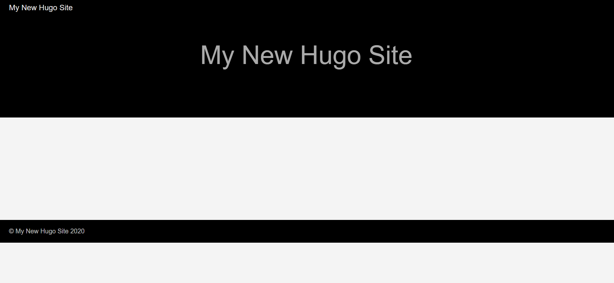
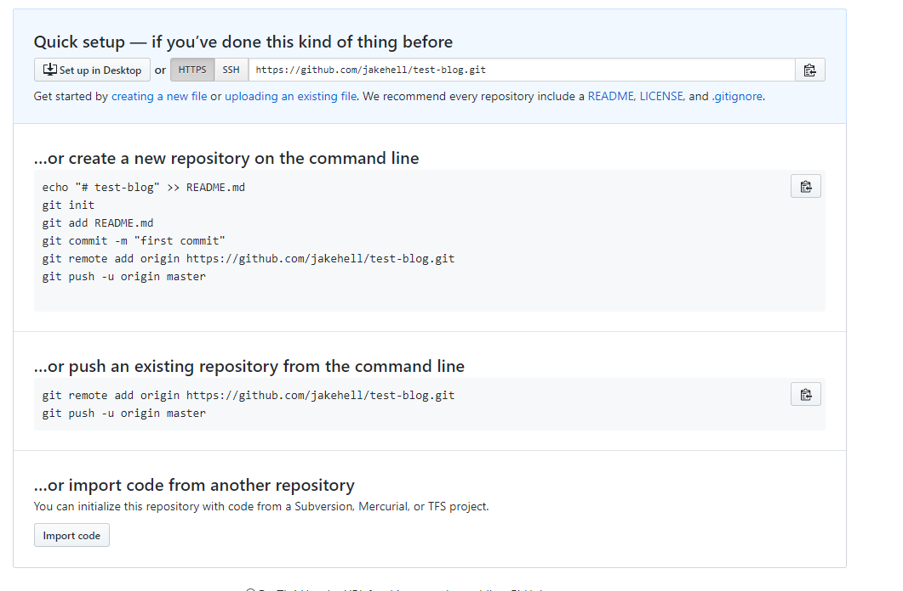
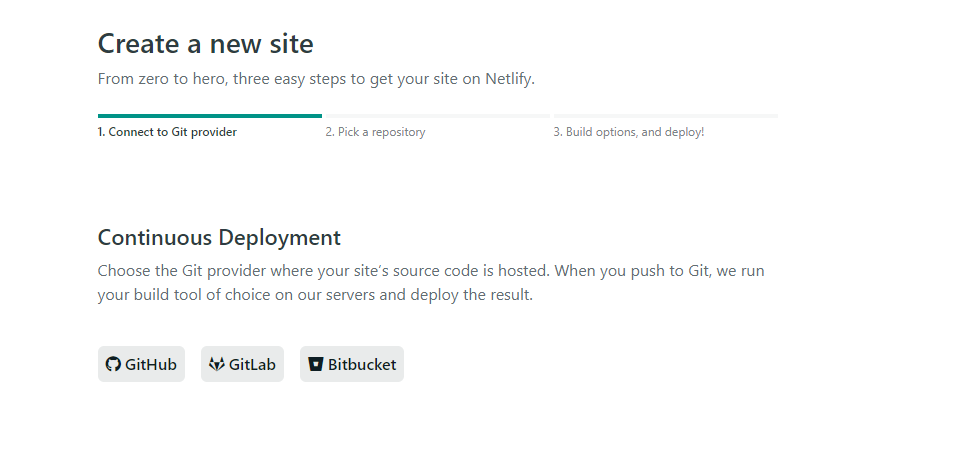
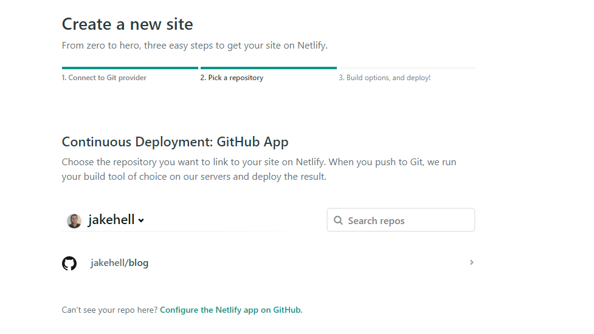
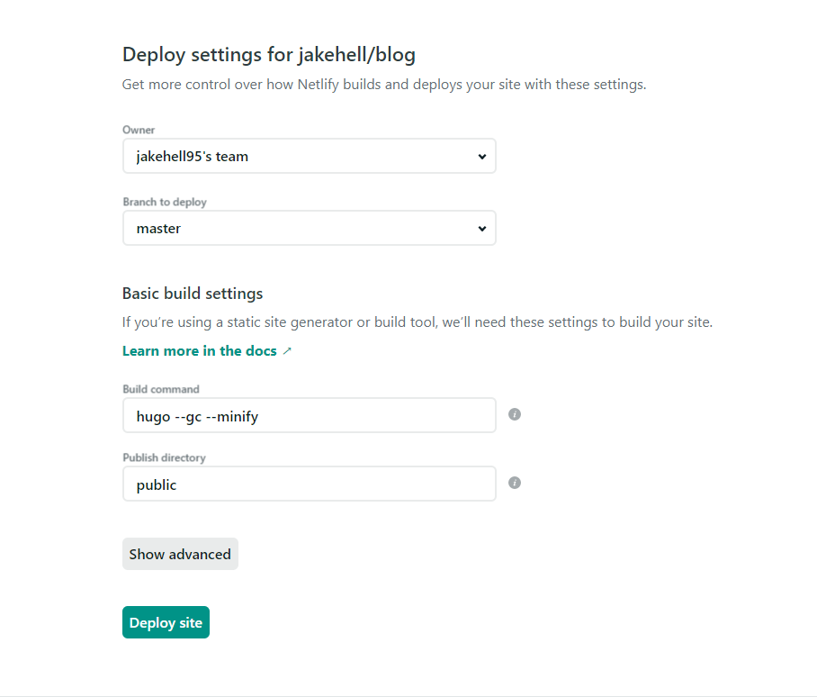
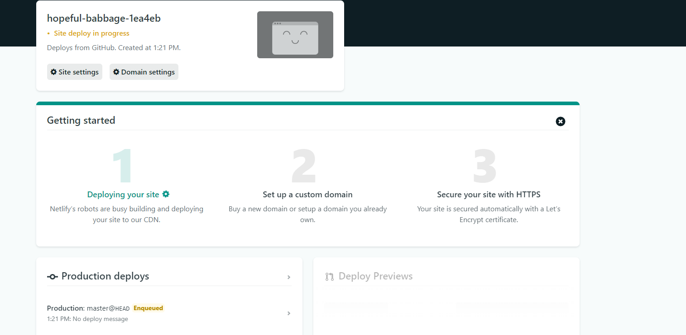
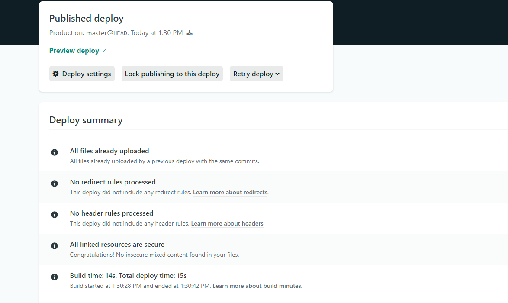

+++

author = "Jacob Hell"
title = "Create a New Hugo Site on Netlify in 7 Easy Steps"
date = "2020-03-29"
description = "Create a New Hugo Site on Netlify"
tags = [
    "hugo",
    "netlify"
]

+++

Hugo is a great static site generator. Netlify is an amazing host for static sites. Let's combine the power of them. 

<!--more-->

### Requirements

Make sure that `hugo` and `git` are installed, and can be called from your command line.

#### Hugo

Run this command:

```
hugo version
```

If installed, the version should print. This is what printed out for me:

```
Hugo Static Site Generator v0.67.1-4F44227B windows/amd64 BuildDate: 2020-03-15T19:32:32Z
```

Otherwise, [here](https://gohugo.io/getting-started/installing/) are the install instructions

#### Git

Run this command:

```
git --version
```

If installed, the version should print. This is what printed out for me:

```
git version 2.21.0.windows.1
```

Otherwise, [here](https://git-scm.com/book/en/v2/Getting-Started-Installing-Git) are the install instructions.


### Step 1: Create New Website

Open your command line, and run:

```
hugo new site <sitename>
```

Replace `<sitename>` with the name of your site. My blog's name is Software Enlightenment, so I used `softwareenlightenment`.

### Step 2: Add a Theme to Your Website

In the same command line window, run:

```
cd <sitename>
git init
git submodule add https://github.com/matsuyoshi30/harbor.git themes/ananke
echo 'theme = "ananke"' >> config.toml
```

Doing this:

1. Makes `<sitename>` a git repo.
2. Adds the `ananke` theme to you website.

[Here](https://themes.gohugo.io/) are the list of themes, if you don't want to use `ananke`. 

### Step 3: Verify Website Works

In the same command line window, run:

```
hugo serve
```

Then in a browser, go to `localhost:1313`. You should see this:

<div style="text-align:center"></div>

### Step 4: Create netlify.toml

In the `<sitename>` directory (where `config.toml` is), make a file named `netlify.toml`.

Copy and paste this into `netlify.toml`:

```toml
[build]
publish = "public"
command = "hugo --gc --minify"

[context.production.environment]
HUGO_VERSION = "0.68.3"
HUGO_ENV = "production"
HUGO_ENABLEGITINFO = "true"

[context.split1]
command = "hugo --gc --minify --enableGitInfo"

[context.split1.environment]
HUGO_VERSION = "0.68.3"
HUGO_ENV = "production"

[context.deploy-preview]
command = "hugo --gc --minify --buildFuture -b $DEPLOY_PRIME_URL"

[context.deploy-preview.environment]
HUGO_VERSION = "0.68.3"

[context.branch-deploy]
command = "hugo --gc --minify -b $DEPLOY_PRIME_URL"

[context.branch-deploy.environment]
HUGO_VERSION = "0.68.3"

[context.next.environment]
HUGO_ENABLEGITINFO = "true"
```

The settings above were taken from [here](https://gohugo.io/hosting-and-deployment/hosting-on-netlify/#configure-hugo-version-in-netlify).

### Step 5: Push to GitHub

Make a new repository on GitHub.

You will be taken to the quick setup page. Copy the https link:



In the command line window, run:

```
git remote add origin <https link you copied>
git add .
git commit -m 'initial commit'
git push -u origin master
```

Verify that your code was pushed.

### Step 6: Linking Netlify and GitHub

1. Open Netlify in your web browser, then go to `Sites`.

2. Click `New site from Git`

3. Click `GitHub`

   

4. Enter your GitHub credentials

5. Choose the site repository

   

6. Click the `>` Icon

7. Validate that `Branch to deploy` is `master`.

   1. build command is `hugo --gc --minify`
   2. publish directory is `public`

   

8. Click `Deploy site`

### Step 7: Site Should be Live!

Should see this page:

<div style="text-align:center"></div>

Once Netlify finishes deploying, should see this:
<div style="text-align:center"></div>

Click `Preview deploy`. You will be taken to your live site!

### Conclusion

There's not much in life that you can do in 7 steps. You can rest well at night knowing that hosting hugo sites on Netlify is an exception.

Let me know if you have problems performing these steps.