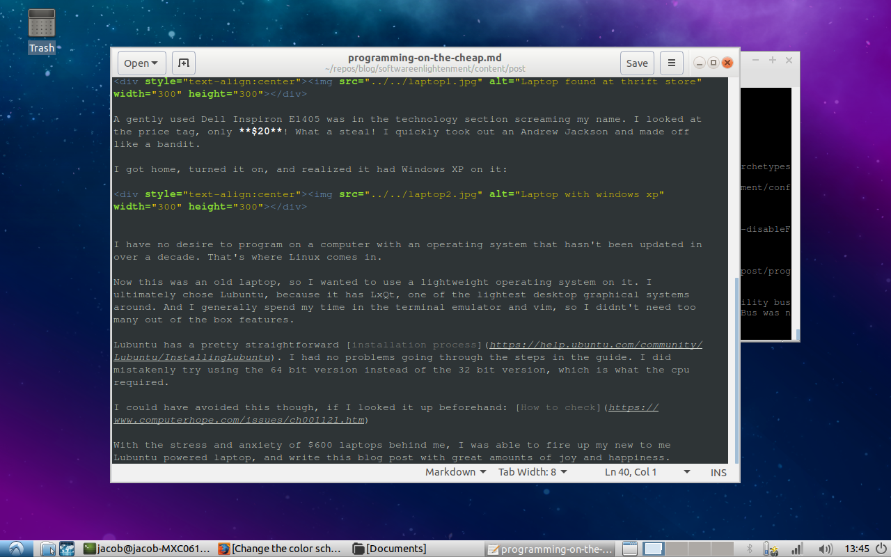

+++
author = "Jacob Hell"
title = "Programming on the Cheap. How to Program on a $20 Device."
date = "2020-03-13"
description = "Programming on a thrift store laptop."
tags = [
    "linux",
    "frugal",
]

+++

Like most people, I like to do things as cheaply as possible.

<!--more-->

This thought extends to programming for me. Lucky for us who are software developers, a lot of the tools we get to use are free.

This includes programming languages with their compilers, IDEs and editors, and even operating systems. We can thank the pioneers of the
free software movement and GNU project for this.

However, one thing we can't get for free is the computer that we write, compile, and run our programs on. Not only are computers not 
free, they can be very expensive! In fact, on [TechRadar](https://www.techradar.com/news/best-laptop-for-programming#8-asus-chromebook-flip), the "affordable" option is the Asus Chromebook Flip. This machine retails for **$579**! If I was non developer looking to get into programming, I would be out almost **$600** before a single stroke of the keyboard.

Knowing this, I decided to pop into my local thrift store and see if there was a remedy for this insanity. That's when I found this beauty:

A gently used Dell Inspiron E1405 was in the technology section screaming my name. I looked at the price tag, only **$20**! What a steal! I quickly took out an Andrew Jackson and made off like a bandit.

I got home, turned it on, and realized it had Windows XP on it:

I have no desire to program on a computer with an operating system that hasn't been updated in over a decade. That's where Linux comes in.

Now this was an old laptop, so I wanted to use a lightweight operating system on it. I ultimately chose Lubuntu, because it has LxQt, one of the lightest desktop graphical systems around. And I generally spend my time in the terminal emulator and vim, so I didnt't need too many out of the box features.

Lubuntu has a pretty straightforward [installation process](https://help.ubuntu.com/community/Lubuntu/InstallingLubuntu). I had no problems going through the steps in the guide. I did mistakenly try using the 64 bit version instead of the 32 bit version, which is what the cpu required. 

I could have avoided this though, if I looked it up beforehand: [How to check](https://www.computerhope.com/issues/ch001121.htm)

With the stress and anxiety of $600 laptops behind me, I was able to fire up my new to me Lubuntu powered laptop, and write this blog post with great amounts of joy and happiness.

