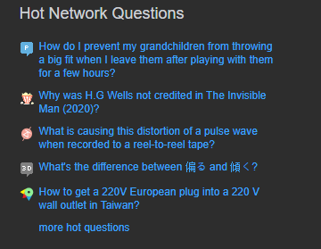
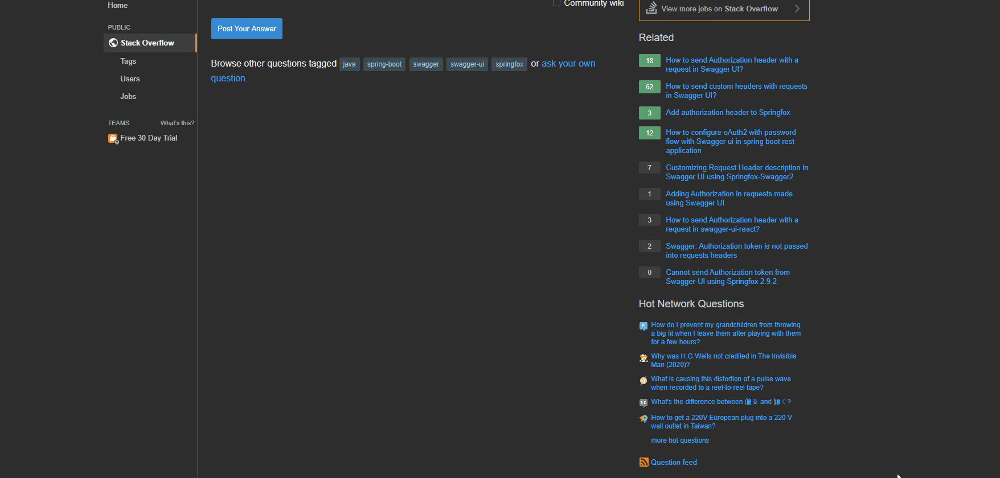

+++

author = "Jacob Hell"
title = "How to Use uBlock Origin to Limit Distractions"
date = "2020-05-19"
description = "Blocking distracting things with U Block Origin"
tags = [
    "productivity"
]

+++

uBlock Origin is usually used to block unwanted ads. But it is also a powerful tool to increase productivity.

<!--more-->

Like most people, I get distracted by shiny things easily. By "Shiny Things", I mean interesting headlines, news articles, and videos.

I'm different though, because I know that I need to block the shiny things before my feeble human brain can see them. Luckily, I know of just the tool to help me.

### uBlock Origin

The author and maintainer of uBlock Origin, Raymond Hill, is dedicated to privacy. Unlike other ad blocking services, uBlock specifically refuses donations and "Approved Ads". So you have no reason to worry that things will get unblocked.

### The Problem I Had

So I have a website that I go on frequently. It is called [StackOverflow](https://stackoverflow.com/). It is a question and answer site for programming and computer problems. It is a part of a larger question and answer site called [StackExchange](https://stackexchange.com/).

Unfortunately for those distracted by shiny things, StackOverflow has a "Hot Network Questions" section. This section has posts from other parts of StackExchange. The questions posted here are often very interesting, and they are difficult to resist clicking on.

Here's an example:

As far as I know, there is no way to hide this section. Even if you have a StackOverflow account.

### Blocking Distracting Things

It's easy to block distracting things using uBlock Origin. Watch the gif below:

I hope this helped on your quest to reduce distractions.